# Mobile Cable-Driven Parallel Robot in Isaac Sim

**Four quadrotors and four differential-drive ground robots carry one 6-DOF platform on eight winched cables.**
A physics-accurate simulation of the system from the doctoral thesis *Quadrotor-Based Mobile Cable-Driven Parallel
Manipulator* (Dr. Siddharth Umakarthikeyan, SASTRA Deemed to be University, India), built on NVIDIA Isaac Sim 6.0
with PhysX at 1 kHz.

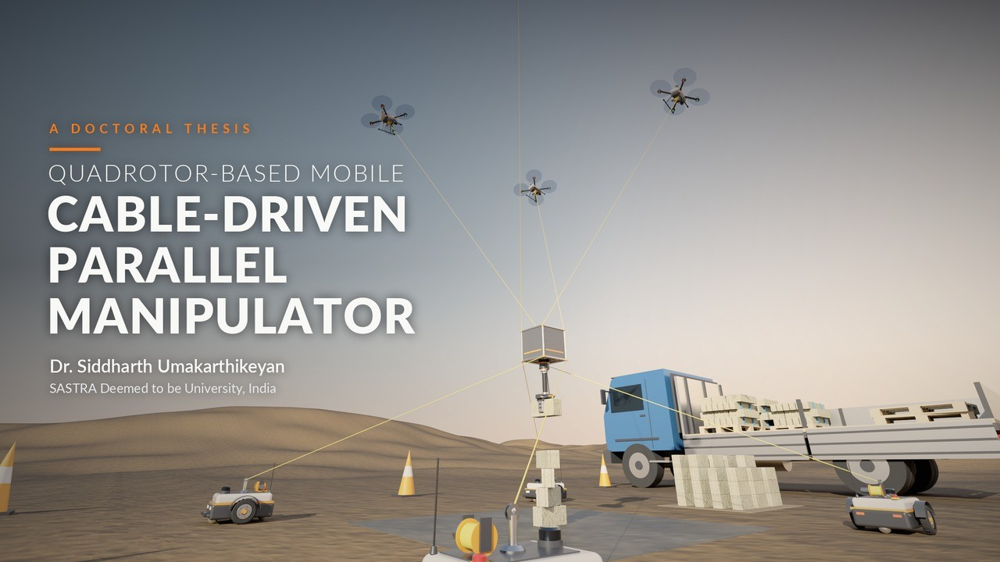

The platform is moved in three ways at once: the robots move, the winches change the cable lengths, and the cable
tensions are redistributed. Because the anchors are robots, the machine has no fixed frame and its workspace
travels with it.

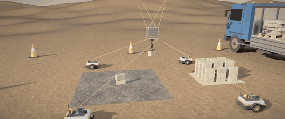

## The system

| | |
|---|---|
| 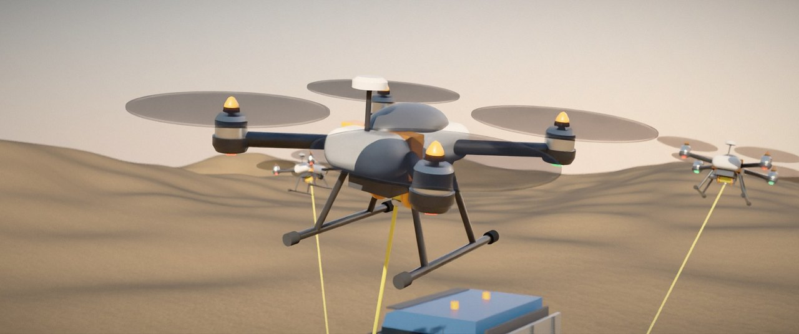 | 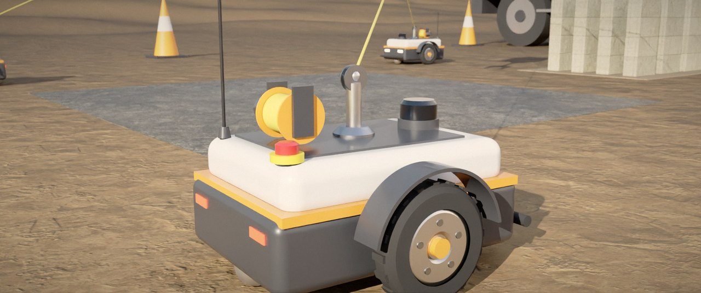 |
| **Quadrotors (4):** upper anchors. 2 kg, 450 mm class, geometric SE(3) controller at 500 Hz, rotor dynamics, winch with a load cell. | **Ground robots (4):** lower anchors. 20 kg differential-drive base with a winch mast, wheel servo in PhysX. |
| 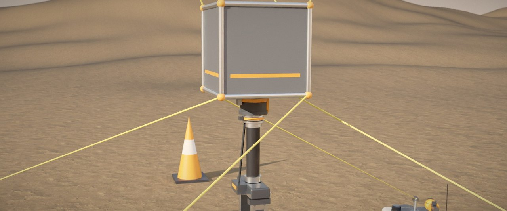 | 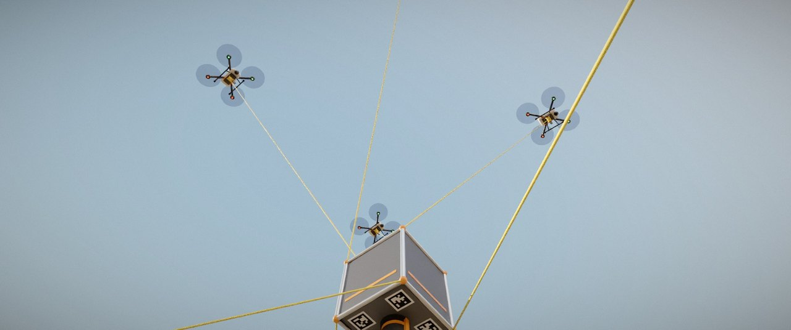 |
| **Platform:** 0.30 m cube, 3 kg, a cable on each of its eight corners, AprilTags, and a wrist with a force sensor and a parallel gripper. | **Cables and winches:** 2 mm UHMWPE rope as a spring-damper with slack, drum winch with inertia, friction, torque and speed limits. |

## What is modelled

- **Cables:** axial stiffness and damping, no compression (a cable can go slack), lumped cable weight.
- **Winches:** length servo or tension regulation per cable, with drum inertia, friction and limits.
- **Platform control:** inverse kinematics plus a closed-form tension distribution with bounds and damping, at 250 Hz.
- **Hybrid cable control:** the drone winches regulate tension and the ground winches regulate length; the platform
  pose is closed with a wrench PID. With all eight winches in length mode the drones run away at tilt limits of
  38° and above; the hybrid mode is stable there.
- **Cable layout:** each platform corner can be wired to its own robot (straight) or to the neighbouring robot
  (crossed). Straight cables give no yaw control (structure matrix rank 5); crossed cables give full 6-DOF control.
  The crossing angle can be changed while the system runs.
- **Formation:** the robots hold position while the platform is inside the region the winches alone can serve, and
  move only as far as needed when it leaves.
- **Team path planning:** RRT*, pruning and Bézier smoothing for the platform, with the ground robots and all eight
  cables checked against the obstacles.
- **Sensors and ROS 2:** gimballed cameras on every robot, drone IMU and visual-odometry camera, 2D lidar on the
  ground robots, published through Isaac Sim's bundled ROS 2 Humble.

## Demonstrations in simulation

| | |
|---|---|
| 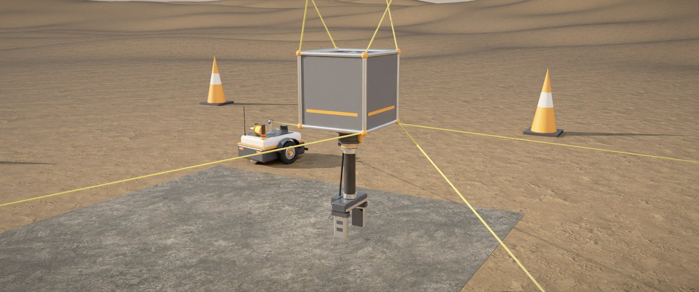 | 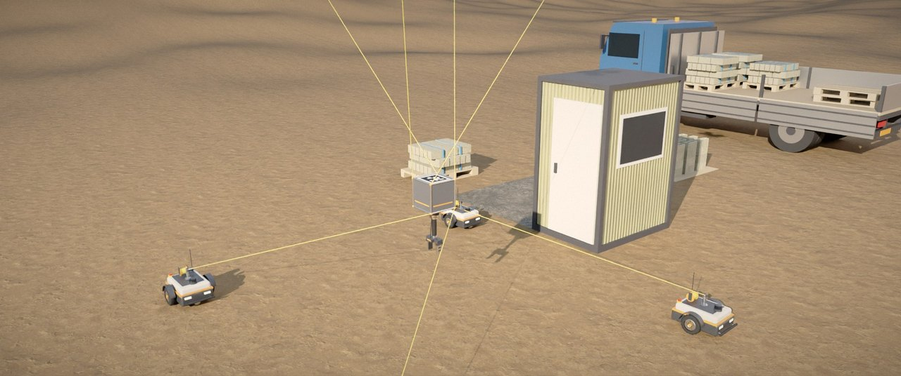 |
| **Trajectory tracking:** a 3D figure-eight, 1.8 × 1.2 × 0.5 m. | **Team planning:** the whole team, cables included, passes a site cabin and a pallet. |
| 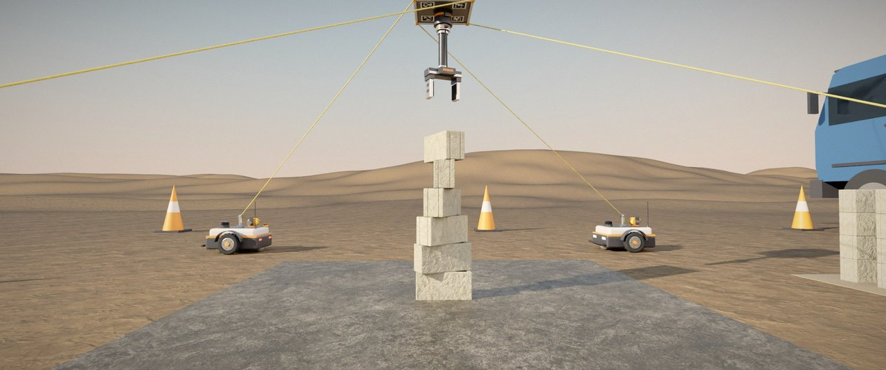 | 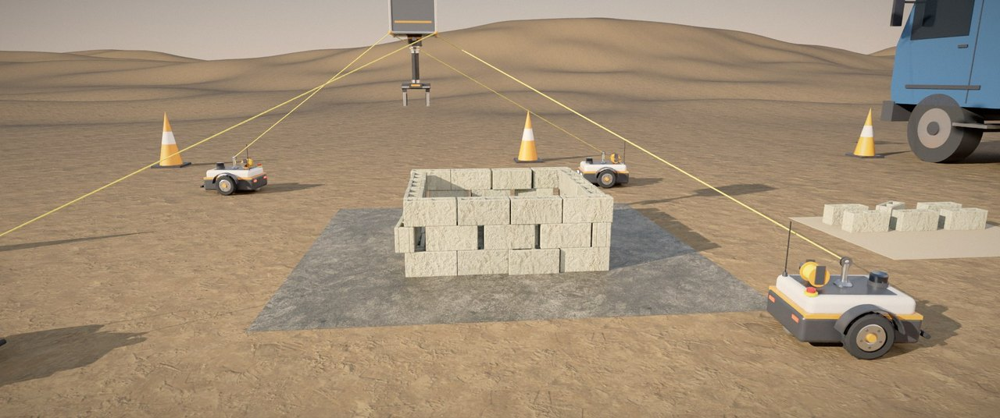 |
| **Block assembly, tower:** six 2.2 kg blocks picked from the pallet and stacked; placement error 1.7 mm mean, 3.6 mm max. | **Block assembly, enclosure:** 42 blocks in three courses, all standing; placement error 12.7 mm mean. |
| 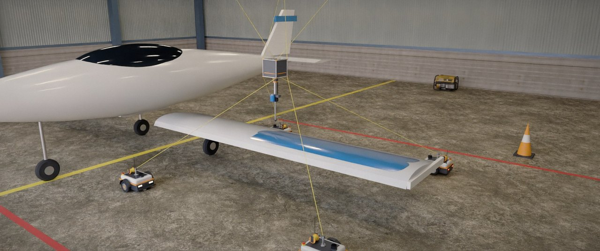 | 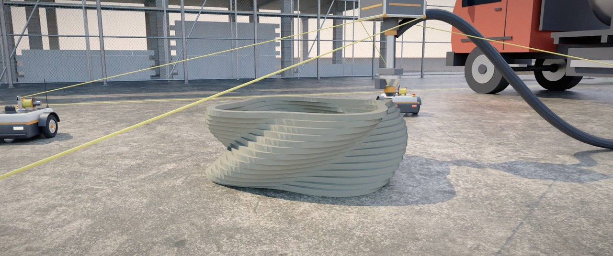 |
| **Aircraft wing painting:** four lanes over the upper skin with the wing as a real collider; tracking 3.4 mm mean. | **3D printing:** one continuous 51 m spiral in 30 mm layers; tracking 5.3 mm mean. |

The paint film, the printed bead and the supply hose are drawn along the recorded tool path for the renders; they
are not simulated and put no load on the platform.

## Getting started

Requirements: Ubuntu 22.04, an RTX GPU, and
[Isaac Sim 6.0.1](https://docs.isaacsim.omniverse.nvidia.com/) (standalone). The scripts expect it at
`~/isaac-sim-standalone-6.0.1-linux-x86_64`; set `ISAAC_SIM` to use another location.

```bash
git clone https://github.com/siddharthumakarthikeyan/QCDPM-Isaac-Sim.git
cd QCDPM-Isaac-Sim

./launch.sh                       # interactive sim: GUI, sensors, ROS 2
./launch.sh --no-sensors --demo   # scripted manoeuvre: lift, tilt, then move the whole formation
```

Recorded tasks (add `--gui` to watch; each writes `recordings/<name>.npz`):

```bash
ISAAC=~/isaac-sim-standalone-6.0.1-linux-x86_64/python.sh

$ISAAC run_task.py --pattern tower --gui        # block assembly: tower | pyramid | compound | dome | column
$ISAAC run_traj.py --scenario track --gui       # track | plan | paint | print
```

Tests and analysis:

```bash
python3 tests/reference_sim.py                  # Isaac-free reference model
$ISAAC tests/isaac_physics_test.py              # headless physics check in Isaac
python3 analysis/theory.py                      # layout proofs and the numbers the experiments must reproduce
experiments/run_all.sh && python3 analysis/compare.py
```

The default scene is a plain tiled floor and needs no downloads. The construction-site scene uses CC0 assets from
Poly Haven: `python3 tools/fetch_assets.py`.

## ROS 2 interface

The node runs inside the Isaac process and stamps everything with simulation time.

| Topic | Type | |
|---|---|---|
| `/cdpr/platform/cmd_pose` | `geometry_msgs/PoseStamped` | platform target (subscribed) |
| `/cdpr/platform/pose_gt`, `/cdpr/platform/odom_gt` | `PoseStamped`, `Odometry` | platform ground truth |
| `/cdpr/cables` | `sensor_msgs/JointState` | per cable: length, rate, measured tension |
| `/cdpr/cables/tension_des` | `std_msgs/Float64MultiArray` | tension distribution output |
| `/cdpr/winch/cmd`, `/cdpr/winch/auto` | `JointState`, `Bool` | manual winch commands, back to automatic |
| `/drone_k/odom_gt`, `/drone_k/imu`, `/drone_k/cmd_pose` | | per drone |
| `/ugv_k/odom_gt`, `/ugv_k/cmd_vel`, `/ugv_k/cmd_goal` | | per ground robot |

The full list is at the top of [`cdpr_sim/ros_iface.py`](cdpr_sim/ros_iface.py).

## Repository layout

| Path | Contents |
|---|---|
| `config/cdpr.yaml` | every physical and control parameter, with units and the reason for each value |
| `cdpr_sim/` | scene construction, cable / winch / rotor / base models, platform control, planning, tools, ROS interface |
| `run_sim.py`, `launch.sh` | interactive simulation with sensors and ROS 2 |
| `run_task.py`, `run_traj.py` | recorded block-assembly tasks and trajectory scenarios |
| `analysis/` | layout theory, workspace computation and its learned surrogate, hold-region analysis |
| `experiments/` | Isaac experiments that test the analytical predictions |
| `tests/` | Isaac-free reference simulation and headless Isaac checks |
| `tools/` | offline rendering of recordings and video assembly |

## Status and limits

This is a simulation; nothing here has been run on hardware.

- The controllers use ground-truth poses from the simulator. The sensors are simulated and published but are not
  yet in the control loop.
- Dense builds are not solved: in the enclosure, 19 of 42 blocks are more than 10 mm off, and the dome pattern
  does not stand.
- The simulation runs at about 0.3× real time on one CPU core for physics.
- Not every scenario has been re-run after the latest changes to the formation and ground-robot model: the
  tracking, planning, painting, printing and enclosure numbers above predate them.

## Publications from the thesis

- *Expanding the wrench-feasible workspace of quadrotor-based cable-driven manipulators.* Computers and Electrical
  Engineering, Elsevier, 2024.
- *Sampling-based 3D path planning for heterogeneous multi-robot cable-driven systems.* Journal of the Brazilian
  Society of Mechanical Sciences and Engineering, Springer, 2025.

The original CoppeliaSim and ROS Noetic simulation is at
[Quadrotor-Based-Cable-Driven-Parallel-Manipulator](https://github.com/siddharthumakarthikeyan/Quadrotor-Based-Cable-Driven-Parallel-Manipulator).

## Licence and citation

This code is **not open source**. It is free to view and to use for non-commercial research and teaching, provided
the thesis and this repository are cited. Redistribution and commercial use need written permission. The full terms
are in [LICENSE](LICENSE).

```bibtex
@phdthesis{umakarthikeyan_qcdpm,
  author = {Umakarthikeyan, Siddharth},
  title  = {Quadrotor-Based Mobile Cable-Driven Parallel Manipulator},
  school = {SASTRA Deemed to be University},
  year   = {2025},
  month  = jul,
  note   = {Simulation: https://github.com/siddharthumakarthikeyan/QCDPM-Isaac-Sim}
}
```

## Author

Dr. Siddharth Umakarthikeyan. Thesis supervised by Dr. Badri Narayanan R, SASTRA Deemed to be University, India.
